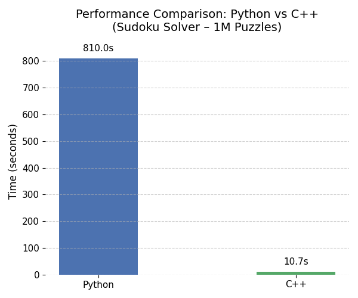

# Sudoku Solver & Benchmark Project

This project builds a Sudoku solver that works both as a web app and as a performance benchmark between Python and C++. The goal is to show how different languages perform using the exact same logic (recursive backtracking), and to give users an interactive way to solve puzzles manually through a web interface.

---

## Project Overview

- A Python Flask web app that lets users enter a Sudoku puzzle and solve it in the browser
- A backtracking algorithm implemented in both Python and C++
- A speed comparison between the two: solving 1 million Sudoku puzzles
- A visual benchmark that shows how much faster C++ can be for the exact same task

---

## How It Works

### Python Web App (`app.py`)
- This is the interactive part
- You can type a puzzle and hit "Solve"
- The logic is based on recursive backtracking
- Styled with basic HTML/CSS for simplicity

### C++ Solver (`sudoku_cpp.cpp`)
- This runs the same logic but written in C++
- It reads 1 million puzzles from `sudoku.csv` and solves them
- It times the process and outputs the result to `cpp_time.txt` so Python can read it

---

## Performance Benchmark

Using the same backtracking algorithm:
- **Python:** ~810 seconds (~13.5 minutes)
- **C++:** ~10.7 seconds

This means the C++ version was approximately **80× faster**.

---

## Performance Plot

The chart below visualises the difference between solving times:



---

## Technologies Used

| Component           | Tech Used            |
|---------------------|----------------------|
| Web Framework       | Python (Flask)       |
| Visualisation       | Python (Matplotlib)  |
| Backend Benchmark   | C++ (g++, chrono)    |
| Dataset             | [Kaggle Sudoku](https://www.kaggle.com/datasets/bryanpark/sudoku) |
| Deployment          | Render               |

---

## Live Demo

You can try the interactive Sudoku solver here:  
**(https://samihaque.pythonanywhere.com)**  

---

## How to Run It

### Benchmark (C++ + Python)

```bash
# Compile and run the C++ solver
g++ -O2 sudoku_cpp.cpp -o sudoku_cpp
./sudoku_cpp

# Then run the Python script to generate the plot
python3 benchmark_plot.py
